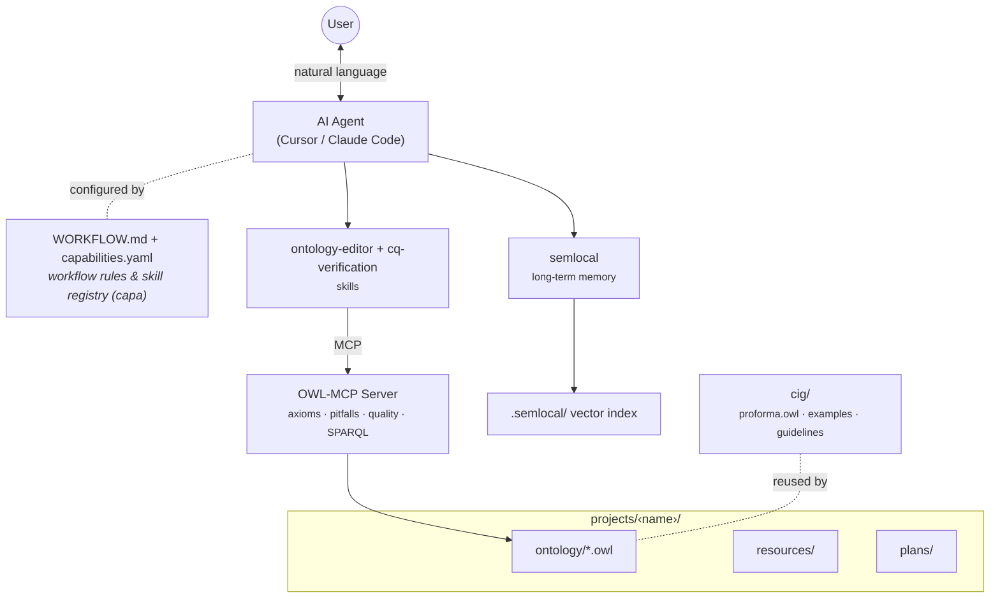

# Agentic CIG Monitoring Development Kit

Build or edit ontologies with AI assistance in Cursor or Claude Code. You install the required tools, put your ontology files in the right place, and tell the agent what you want. The agent handles scope, proposals, PROforma-based formalization, and checks.

**Primary use case — CIG monitoring:** this kit specializes in instantiating the **PROforma computer-interpretable guideline (CIG) ontology** (`cig/proforma.owl`) for a clinical guideline, focusing on monitoring completion of therapy recommendations (Action Enactment goals) and monitoring desired/undesired effects of therapy (State Achievement goals). For CIG tasks the agent follows the **`cig-monitoring`** skill, reads guideline PDFs from the shared `cig/guidelines/` library, and builds a PROforma Top-Level Plan (Enquiry → Decision → Therapy Plan → Monitoring Plan). See `cig/know-how/READNE.md` for the domain know-how and `cig/examples/obesity-glp1.owl` for a worked example.

## Architecture



## What you need to do

1. **Install prerequisites** (below).
2. **Run `capa install`** once in the project root after cloning.
3. **Put existing OWL files under `projects/<project_dir>/`** (e.g. `projects/my-ontology/ontology/my-ontology.owl`) if you are editing an existing ontology. For a new one, create an empty OWL file under `projects/<project_dir>/ontology/` and describe what you want.
4. **Chat with the agent**—describe your goal and approve proposals. It will edit the ontology, reuse PROforma, and run checks for you.

## Prerequisites

Install these before starting:


| Requirement             | Purpose                                                                                                                                          |
| ----------------------- | ------------------------------------------------------------------------------------------------------------------------------------------------ |
| **Node.js** (v18+)      | Used to run the capa CLI and the OWL-MCP server (via `npx`). [Install Node.js](https://nodejs.org/).                                             |
| **semlocal**            | Local semantic memory. Install with `npm install -g semlocal`. Index stored in `.semlocal/`. [semlocal](https://github.com/Minitour/semlocal) |
| **capa**                | Syncs the agent’s skills and tools from this project. [CAPA](https://capa.infragate.ai/). After cloning, run `capa install` in the project root. |


## Setup

1. Clone the this repository and open it with your agent of choice
2. Run `capa install` and ensure your agent has access to the capa MCP server.
3. Add any relevant files you have to `projects/<project_dir>/resources`.

## Where to put your ontology files

- **Existing ontology**: Put your OWL file(s) under **`projects/<project_dir>/`**, for example `projects/my-ontology/ontology/my-ontology.owl`. The agent will work with whatever you put there.
- **New CIG instantiation**: Create an empty OWL file in `projects/<project_dir>/ontology/` and describe the clinical guideline you want to model. The agent reuses the PROforma classes/properties from `cig/proforma.owl` by IRI and follows the `cig-monitoring` skill.

PROforma reference material — the meta-ontology (`cig/proforma.owl`), worked examples (`cig/examples/`), and the guideline PDF library (`cig/guidelines/`) — lives under `cig/`. You do not redeclare PROforma terms yourself; the agent references them by IRI.

## Project layout (reference)

```
ontology-builder/
├── capabilities.yaml   # Agent skills and tools (managed by capa)
├── WORKFLOW.md         # Agent instructions (for the agent, not you)
├── cig/                # Shared CIG reference material (reusable across projects)
│   ├── proforma.owl    # PROforma CIG meta-ontology to instantiate (do not edit)
│   ├── examples/       # Worked instantiations (e.g. obesity-glp1.owl)
│   ├── guidelines/     # Shared clinical guideline PDF library
│   └── know-how/       # CIG monitoring domain know-how
├── projects/           # One directory per ontology project
│   └── <project_dir>/  # e.g. obesity-glp1-monitoring, my-ontology
│       ├── ontology/   # e.g. projects/<project_dir>/ontology/my-ontology.owl
│       ├── plans/      # Draft proposals made by the agent
│       └── resources/  # Resources to give to the agent (PDFs, CSVs, etc.)
└── skills/             # Agent skills (incl. cig-monitoring)
```

